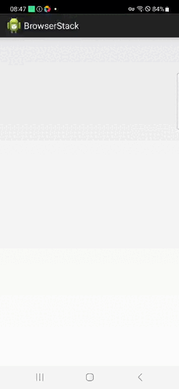

# Проект по автоматизации тестирования мобильного приложения [Wikipedia](https://ru.wikipedia.org/)

<a href="https://ru.wikipedia.org/"></a>
---
##  **Содержание:**

---

* [Технологии и инструменты](#технологии-и-инструменты)
* [Реализованные автоматизированные тесты](#реализованные-автоматизированные-тесты)
* [Запуск тестов - сборка в Jenkins](#запуск-тестов---сборка-в-jenkins)
* [Запуск тестов - локальный](#запуск-тестов---локальный)
* [Allure Report](#allure-report)
* [Allure TestOps](#allure-testops)
* [Jira](#jira)
* [Уведомление в Telegram о результатах тестов](#уведомление-в-telegram-о-результатах-тестов)
* [Пример видео выполнения теста в Browserstack](#пример-видео-выполнения-теста-в-Browserstack)

## Технологии и инструменты:

---


<p align="center">  
<a href="https://www.jetbrains.com/idea/"></a>  
<a href="https://www.java.com/"></a>  
<a href="https://github.com/"></a>  
<a href="https://junit.org/junit5/"></a>  
<a href="https://gradle.org/"></a>  
<a href="https://selenide.org/"></a>  
<a href="https://aerokube.com/selenoid/"></a>
<a href="https://www.jenkins.io/"></a>
<a href="https://github.com/allure-framework/"></a>
</p>

---

## Реализованные автоматизированные тесты:

---

- *Проверка соответствия всех экранов онбординга*
- *Проверка перехода по экранам посредством навигации*
- *Попытка авторизации с некорректными данными*
- *Создание reading list*

---

## Запуск тестов - сборка в [Jenkins](https://jenkins.autotests.cloud/job/30-tinwhip-MOBILE_FINAL_PROJECT/):

---

<p align="center">  
  
</p> 

***Запуск через Jenkins производится посредством Browserstack. Для запуска тестов необходимо кликнуть 'Build with Parameters' и выбрать testType***

***Ключ testType позволяет запустить тесты с конкретным тэгом, либо выбор всех тестов для запуска:***
- *test - запускает все тесты*
- *onboarding_test - запускает тесты на онбординг*
- *navigation_test - запускает тесты на навигацию*
- *login_test - запускает тесты на логин*
- *readingList_test - запускает тесты на reading list*

## Запуск тестов - локальный
___
Для локального запуска необходимо сконфигурировать файлы .properties (для browserstack требуется создание auth.properties)

***Локальный запуск (вместо test можно выбрать другой ключ, см. пункт выше):***
- *-DdeviceHost=browserstack - запускает тесты удаленно посредством Browserstack*
- *-DdeviceHost=emulator - запускает тесты через эмулятор, предварительно включенный локально*
- *-DdeviceHost=real - запускает тесты через реальное устройство, подключенное локально*

***Пример команды запуска:***
```  
gradle clean test -DdeviceHost=browserstack
```
*Также реализован запуск отдельного теста внутри IDE, посредством запуска через зелёный треугольник*

---
## [Allure Report](https://jenkins.autotests.cloud/job/30-tinwhip-MOBILE_FINAL_PROJECT/allure/)

---

## Основная страница отчёта
***С инфомацией о количестве запущенных тестов, статусе прохождения и графика TREND, отображающего тенденцию прогона тестов***

<p align="center">  
  
</p>  

## Тест-кейсы.
***Содержат подробное описание шагов со скриншотами, видео и Page Source по каждому тесту***

<p align="center">  
  
</p> 


---
## [Allure TestOps](https://allure.autotests.cloud/project/4566/test-cases?treeId=0)

---

## Реализована интеграция с Allure TestOps

<p align="center">  
  
</p>  

---
## [Jira](https://jira.autotests.cloud/browse/HOMEWORK-1384)

---

## Реализована интеграция с Jira

<p align="center">  
  
</p>  

---

## Уведомление в Telegram о результатах тестов
____

<p align="center">  
  
</p>

____

## Пример видео выполнения теста в Browserstack
____
<p align="center">
   
</p>